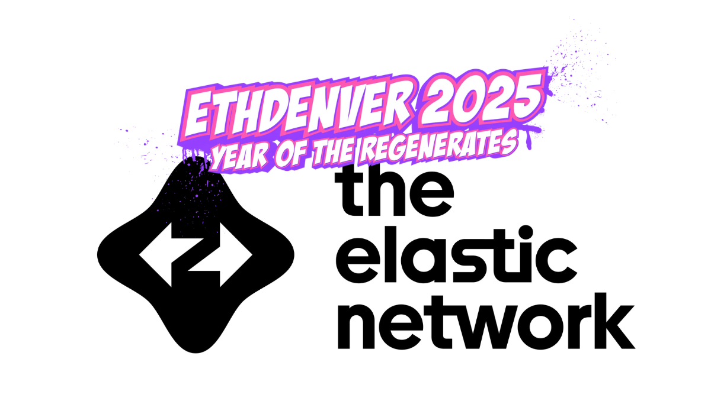

# ZKsync ETH Denver 2025 Developer Resources

  

## Hackathon project requirements

1. You app must **use one of the required tools or themes** for each bounty.
2. Your app must be **deployed on ZKSync Era Testnet or at least run locally on `anvil-zksync`**.
3. **Live Demo & Code Repository**

    - Provide a **working demo** of your app.
    - Submit a **public GitHub repository** with the code.

## General resources

- [Set up ZKsync Era network](https://docs.zksync.io/zksync-era/environment)
- [Testnet faucets](https://docs.zksync.io/zksync-era/ecosystem/network-faucets)
- [ZKsync developer quickstart](https://docs.zksync.io/zksync-era/guides/quick-start)

## Developer tools

- [Foundry ZKsync overview](https://docs.zksync.io/zksync-era/tooling/foundry/overview)
- [Run anvil-zksync for local developement](https://docs.zksync.io/zksync-era/tooling/local-setup/anvil-zksync-node)
- [Hardhat plugin overview](https://docs.zksync.io/zksync-era/tooling/hardhat)
- [ZKsync SSO Getting started](https://docs.zksync.io/zksync-era/unique-features/zksync-sso/getting-started)
- [Ecosystem tools](https://docs.zksync.io/zksync-era/ecosystem)

## Tutorials and template projects

- [Tutorials](https://code.zksync.io/): more than 25 tutorials from Matter Labs and community members
- [Paymaster examples](https://github.com/matter-labs/paymaster-examples): paymaster smart contract for different use cases (gasless, NFT-gated, allow-list, etc)
- [SSO React/Next.js template](https://github.com/uF4No/sso-react-template): a template project with Next.js, Wagmi and SSO.
