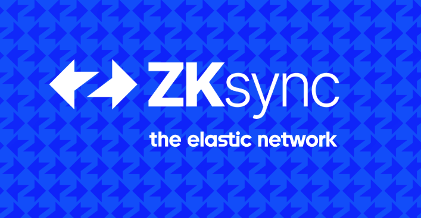

# ZKsync ETH Denver 2025 Developer Resources

## Network details

- [Set up ZKsync Era network](https://docs.zksync.io/zksync-era/environment)

## Documentation

- [ZKsync developer quickstart](https://docs.zksync.io/zksync-era/guides/quick-start)

## Developer tools

- [Hardhat plugin overview](https://docs.zksync.io/zksync-era/tooling/hardhat)
- [Foundry ZKsync overview](https://docs.zksync.io/zksync-era/tooling/foundry/overview)
- [ZKsync SSO Getting started](https://docs.zksync.io/zksync-era/unique-features/zksync-sso/getting-started)
- [Ecosystem tools](https://docs.zksync.io/zksync-era/ecosystem)

## Tutorials and examples

- [Paymaster examples](https://github.com/matter-labs/paymaster-examples)
- [SSO React template](https://github.com/uF4No/sso-react-template)
- [Tutorials](https://code.zksync.io/)
